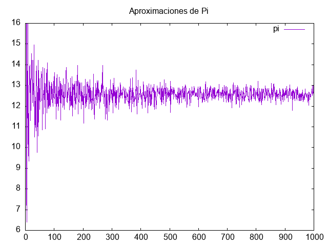

 Aproximación número $\pi$ mediante un método Monte Carlo.

$$\frac{Área círculo }{Área cuadrado} = \frac{\pi r^{2}}{4 r^{2}} = \frac{\pi}{4}$$

La salida del programa es:

		GSL pi: 3.141592653589793116
		Aproximación de pi con 1000 iteraciones: 3.124000000000000110

y el archivo .csv

