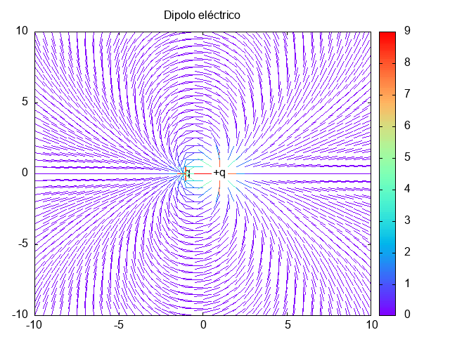

Calcula el campo eléctrico debido a una carga $q$ en $(1,0)$ y $-q$ en $(-1,0)$

$$ \vec{E} = \sum \frac{q_{i}}{r_{i}^{2}} \hat{r_{i}} $$

El programa genera un archivo csv con las coordenadas del vector campo eléctrico y su magnitud en tal punto.

El campo eléctrico fue calculado en la región $(-10,10) \times (-10,10)$

