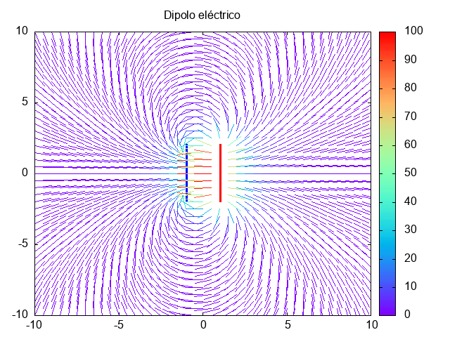

Calcula el campo eléctrico debido a un conjunto de cargas puntuales $q$ colocadas sobre la recta $x = 1$ y por otras colocadas sobre la recta $x = -1$ con carga $-q$ para valores de $y \in [-2,2]$

$$ \vec{E} = \sum \frac{q_{i}}{r_{i}^{2}} \hat{r_{i}} $$

El programa  genera un archivo csv con las coordenadas del vector campo eléctrico y su magnitud en tal punto.

El campo eléctrico fue calculado en la región $(-10,10) \times (-10,10)$

