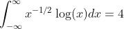

Ejemplo obtenido de https://www.gnu.org/software/gsl/doc/latex/gsl-ref.pdf

Calcula el valor de la integral

La salida del programa es:

		result = -4.000000000000085265
		exact result = -4.000000000000000000
		estimated error =  0.000000000000135447
		actual error = -0.000000000000085265
		intervals = 8
