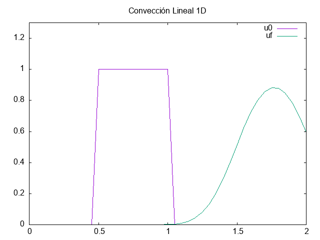

#Convección lineal en una dimensión.

[12 steps to N-S](https://www.theoj.org/jose-papers/jose.00021/10.21105.jose.00021.pdf)
-------------------------

La ecuación de convección lineal en una dimensión es

$$\frac{\partial u}{\partial t} + c \frac{\partial u}{\partial x} = 0,$$

con una condición inicial

$$u(x, t=0) = u_{0}(x),$$

la solución de esta ecuación diferencial es

$$u(x,t) = u_{0}(x-ct).$$

La interpretación de esta ecuación es que para un perfil $u_{0}(x)$ que es desplazado a velocidad $c$ después de un tiempo $t$, entonces $u(x)$ es simplemente el perfil inicial desplazado una distancia $x = ct$. 

#Discretización
-------------------------
El siguiente paso es discretizar la ecuación diferencial. 
Recordamos que la definición de derivada es

$$\frac{d}{dx}f(x) = \lim\limits_{\Delta x \to 0} \frac{f(x + \Delta x) - f(x)}{\Delta x}.$$

Si discretizamos la coordenada espacial en el conjunto de puntos  $x = (x_1, \dots , x_n)$ y aumentos discretos de tiempo $\Delta t$, entonces la ecuación discreta es

$$\frac{u_i^{n+1}-u_i^n}{\Delta t} + c \frac{u_i^n - u_{i-1}^n}{\Delta x} = 0,$$

donde para la derivada temporal, se utiliza una diferenciación hacia adelante, y hacia atrás para la derivada espacial. Dependiendo de que tan pequeños sean los $\Delta x$ y $\Delta t$ la aproximación es mas parecida a la derivada real.

$n$ y $n-1$ representan dos pasos consecutivos en el tiempo, mientras que $i$ e $i-1$ son dos puntos vecinos de la coordenada $x$ discretizada. Si la condición inicial esta dada, entonces el valor $u_i^{n+1}$ es la única incógnita en la ecuación discretizada. Si despejamos para esta función obtenemos una equación que permite avanzar en el tiempo

$$u_i^{n+1} = u_i^n - c \frac{\Delta t}{\Delta x}(u_i^n-u_{i-1}^n).$$

#Ejemplo
-------------------------
Definimos

$$ u(x_0, x_l, x) = 
\begin{cases}
0, &   \text{si $x < x_0$} \\
1, &  \text{si $x_0 \leq x < x_l$} \\
0, &  \text{si $x > x_l$}
\end{cases}$$

el cual representa un pulso entre los valores $x_0$ y $x_l$.

El programa regresa la función en el tiempo $t=0$ y la función después de un tiempo $t=T$ en el archivo .csv.

