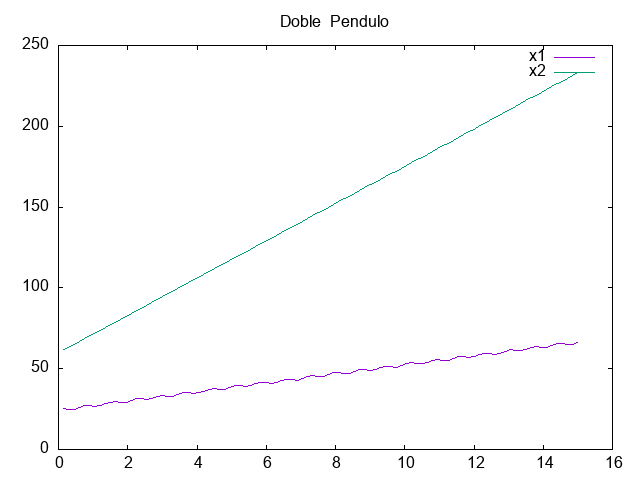
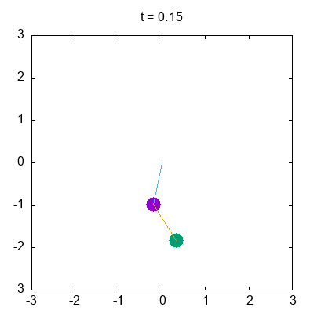

Sean los péndulos de masa $m_1$, $m_2$ y longitudes $l_1$, $l_2$, así como sus coordenadas generalizadas $\theta_1$ y $\theta_2$, el Lagrangiano del sistema es

$$L = \frac{1}{2}(m_1 + m_2) l_1^2 \dot{\theta}_1^2 + \frac{1}{2}m_2 l_2^2 \dot{\theta}_2^2 + m_2l_1l_2\dot{\theta}_1\dot{\theta}_2 \cos(\theta_1 - \theta_2) + (m_1 + m_2) g l_1 \cos\theta_1 + m_2 g l_2\cos\theta_2.$$

Con el Langrangiano podemos obtener los momentos conjugados

$$p_i = \frac{\partial L}{\partial \dot q_i}$$

$$p_{\theta_1} = \frac{\partial L}{\partial \dot{\theta}_1} = (m_1 + m_2) l_1^2 \dot{\theta}_1 + m_2 l_1 l_2 \dot{\theta}_2\cos(\theta_1-\theta_2),$$

$$p_{\theta_2} = \frac{\partial L}{\partial \dot{\theta}_2} = m_2 l_2^2 \dot{\theta}_2 + m_2 l_1 l_2 \dot{\theta}_1\cos(\theta_1-\theta_2),$$

así el Hamiltoniano del sistema es

$$H(\theta_{i}, \dot{\theta_{i}}) = \sum_{i=1}^{2} \dot{\theta_{i}} p_{\theta_{i}} - L,$$

reescribiéndolo en términos de $\theta_i$ y $p_{\theta_i}$ (ver desarrollo completo en https://diego.assencio.com/?index=e5ac36fcb129ce95a61f8e8ce0572dbf)

$$H = \frac{m_2 l_2^2 p^2_{\theta_1} + (m_1 + m_2)l_1^2 p^2_{\theta_2} - 2m_2 l_1 l_2 p_{\theta_1}p_{\theta_2}\cos(\theta_1-\theta_2)}
{2m_2 l_1^2l_2^2 \left[m_1 + m_2\sin^2(\theta_1 - \theta_2)\right]} - (m_1 + m_2) g l_1 \cos\theta_1 - m_2 g l_2\cos\theta_2,$$

y de las ecuaciones de Hamilton

$$\dot{q_i} = \frac{\partial H}{\partial p_i}$$

$$\dot{p_i} = - \frac{\partial H}{\partial q_i}$$

obtenemos las cuatro ecuaciones de movimiento del sistema

$$\dot{\theta}_1 = \;\;\frac{\partial H}{\partial p_{\theta_1}} =
\frac{l_2 p_{\theta_1} - l_1 p_{\theta_2}\cos(\theta_1-\theta_2)}
{l_1^2l_2\left[m_1 + m_2 \sin^2(\theta_1 - \theta_2)\right]}$$

$$\dot{\theta}_2 = \;\;\frac{\partial H}{\partial p_{\theta_2}} =
\frac{-m_2 l_2 p_{\theta_1}\cos(\theta_1-\theta_2) + (m_1 + m_2)l_1 p_{\theta_2}}
{m_2l_1 l_2^2\left[m_1 + m_2\sin^2(\theta_1 - \theta_2)\right]}$$

$$\dot{p}_{\theta_1} = -\frac{\partial H}{\partial \theta_1} =
-(m_1 + m_2)gl_1 \sin\theta_1 - h_1 + h_2\sin\left[2(\theta_1 - \theta_2)\right]$$

$$\dot{p}_{\theta_2} = -\frac{\partial H}{\partial \theta_2} =
-m_2gl_2 \sin\theta_2 + h_1 - h_2\sin\left[2(\theta_1 - \theta_2)\right]$$

siendo

$$h_1 = \frac{p_{\theta_1}p_{\theta_2}\sin(\theta_1 - \theta_2)}
{l_1l_2\left[m_1 + m_2\sin^2(\theta_1 - \theta_2)\right]}$$

$$h_2 = \frac{m_2 l_2^2 p^2_{\theta_1} + (m_1 + m_2)l_1^2 p^2_{\theta_2} - 2 m_2 l_1l_2 p_{\theta_1}p_{\theta_2}\cos(\theta_1 - \theta_2)}{2l_1^2 l_2^2 \left[m_1 + m_2\sin^2(\theta_1 - \theta_2)\right]^2}$$

La salida del programa es el archivo data.csv

