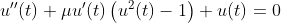
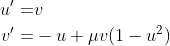
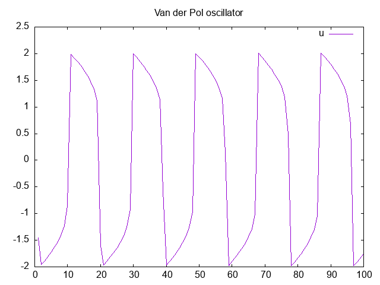

Ejemplo modificado de https://www.gnu.org/software/gsl/doc/html/ode-initval.html#examples

Resuelve la ecuación diferencial no lineal de segundo orden

Mediante el cambio de variable u' = v, se obtiene un sistema de ecuaciones diferenciales de primer orden

La solución comienza desde $(u,v) = (1,0)$ en $t=0$ hasta $t=100$

La salida del programa es la siguiente, en un archivo .csv:

		1.00000e+00 -1.45686e+00 -1.15474e+01
		2.00000e+00 -1.95608e+00 6.90647e-02
		3.00000e+00 -1.88481e+00 7.36425e-02
		4.00000e+00 -1.80842e+00 7.93679e-02
		5.00000e+00 -1.72550e+00 8.68268e-02
		6.00000e+00 -1.63383e+00 9.71295e-02
		7.00000e+00 -1.52952e+00 1.12715e-01
		...

