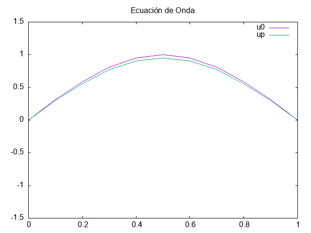

# Ecuación de Onda 1D mediante diferencias finitas.
------------

La ecuación de onda es:

$$ \frac{\partial^2 u}{\partial t^2} - c^2 \frac{\partial^2}{\partial x^2} = 0$$

Las aproximaciones de las segundas derivadas son:

$$ \frac{\partial^2 u}{\partial t^2}(x_{i},t_{n}) = \frac{u_{1,n+1} - 2 u_{i,n} + u_{i,n-1}}{dt^2} + O(dt^2),$$

$$ \frac{\partial^2}{\partial x^2}(x_{i},t_{n}) = \frac{u_{i+1,n} - 2 u_{i,n} + u_{i-1,n}}{dt^2} + O(dx^2).$$

Sustituyendo y despejando para $u_{i,n+1}$ se obtiene la ecuacipon que permite avanzar en el tiempo

$$ u_{i,n+1} = 2(1 - \lambda^{2})u_{i,n} + \lambda^{2} ( u_{i+1,n} + u_{i-1,n} ) - u_{i,n-1},$$

siendo $\lambda = c dt/dx$, $i = 1,\ldots,N_{x}$ y $n = 1,\ldots, N_{t} - 1$.

Para la evolución se requiere de las condiciones iniciales y de frontera

$$ \begin{cases}
u_{i,0} &= f(x_i), & \text{para $i = 1,\ldots,N_{x}$} \\
u_{0,n} &= 0, & \text{para $n = 1,\ldots, N_{t}$} \\
u_{N+1,n} &= 0, & \text{para $n = 1,\ldots, N_{t}$} \end{cases}$$

además para $n=1$ se necesita la información de $u_{i,1}$, el cual se obtiene mediante la condición inicial

$$ \frac{\partial u}{\partial t}(x,0) = g(x),$$

$x \in [0,L]$, y mediante las diferencias finitas se obtiene

$$ u_{i,1} = (1 -\lambda^2}) f(x_{i}) + \frac{\lambda^2}{2} [ f(x_{i+1}) + f(x_{i-1}) ] + dt g(x_{i})$$

# Ejemplo
-----------

Condición inicial

$$ u(x,0) = \sin(\pi x),$$
$$ \frac{\partial u}{\partial t}(x,0) = 0.$$

Para más detalles, consultar http://gmc.geofisica.unam.mx/papime2020/Descargables/presentaciones-metodosnumericos/06_EcuacionDeOnda.pdf

El programa regresa el archivo .csv con el perfil de la función $u(x,0)$ y $u(x,N_{t} -1)$. ($u(x,N_{t})$ coincide con $u(x,0)$).

