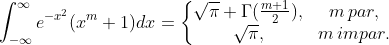

Ejemplo obtenido de  https://www.gnu.org/software/gsl/doc/latex/gsl-ref.pdf

Calcula númericamente la integral

La salida del programa es la siguiente:

		m = 10
		intervals = 6
		result =  54.115231635459096537
		exact result =  54.115231635459025483
		actual error =  0.000000000000071054
