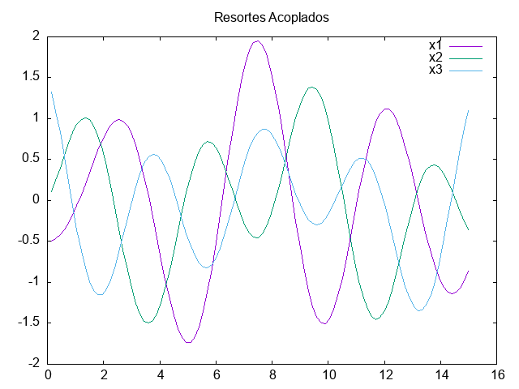
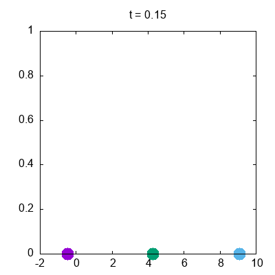
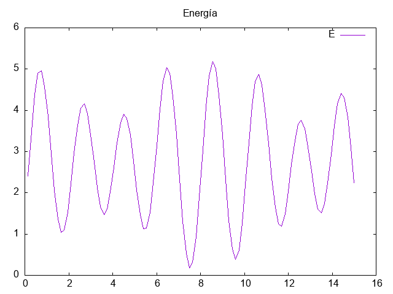

 Sean $m_1$, $m_2$ y $m_3$ las masas de tres partículas conectadas por cuatro resortes con constantes elásticas $k_1$, $k_2$, $k_3$ y $k_4$. El hamiltoniano del sistema esta dado por

$$H = \frac{p_{1}^{2}}{2m_{1}} + \frac{p_{2}^{2}}{2m_{2}} + \frac{p_{3}^{2}}{2m_{3}} + \frac{1}{2} k_{1} x_{1}^{2} + \frac{1}{2} k_{2} (x_{2} - x_{1})^{2} + \frac{1}{2} k_{3} (x_{3} - x_{2})^{2} + \frac{1}{2} k_{4} x_{3}^{2}.$$

De las ecuaciones de Hamilton,

$$\dot{x_i} = \frac{\partial H}{\partial p_i},$$

$$\dot{p_i} = - \frac{\partial H}{\partial q_i},$$

se eobtienen las 4 ecuacionese de movimiento:

$$ \dot^{x_{1}} = \frac{p_{1}}{m_{1}}, $$
$$ \dot^{x_{2}} = \frac{p_{2}}{m_{2}}, $$
$$ \dot^{x_{3}} = \frac{p_{3}}{m_{3}}, $$
$$ \dot^{p_{1}} = -k_{1} x_{1} + k_{2} (x_{2} - x_{1})$$
$$ \dot^{p_{2}} = -k_{2} (x_{2} - x_{1}) + k_{3} (x_{3} - x_{2})$$
$$ \dot^{p_{3}} = -k_{3} (x_{3} - x_{2}) + k_{4} x_{3}$$

La salida del programa es el archivo "data.csv"

