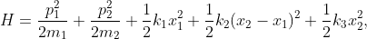
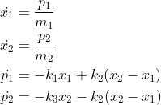
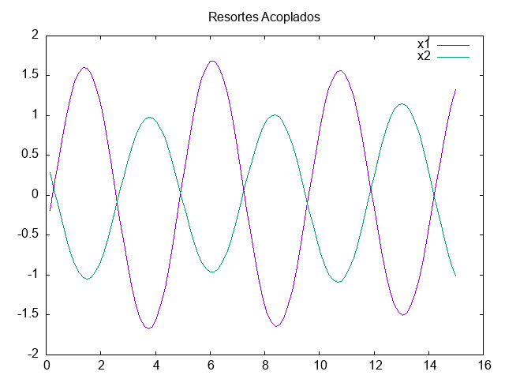
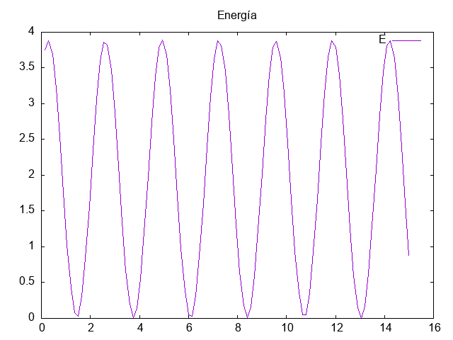

 Sean m1, m2 las masas de dos partículas conectadas por tres resortes con constantes elásticas k1, k2 y k3. El hamiltoniano del sistema esta dado por

La dinámica del sistema esta dado por el sistema de ecuaciones diferenciales

La salida del programa es el archivo "data.csv"

