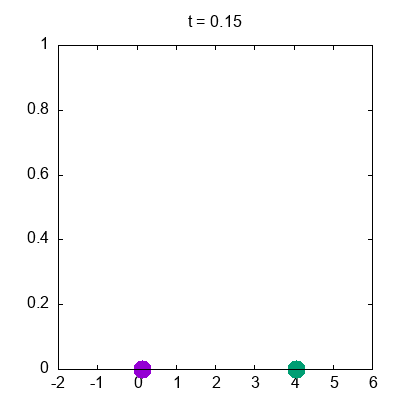

 Sean m1, m2 las masas de dos partículas conectadas por tres resortes con constantes elásticas k1, k2 y k3. El hamiltoniano del sistema esta dado por

de las ecuaciones de Hamilton,

\begin{equation}
\dot{x_i} = \frac{\partial H}{\partial p_i}
\end{equation}

\begin{equation}
\dot{p_i} = - \frac{\partial H}{\partial q_i}
\end{equation}

se eobtienen las 4 ecuacionese de movimiento:

La salida del programa es el archivo "data.csv"

