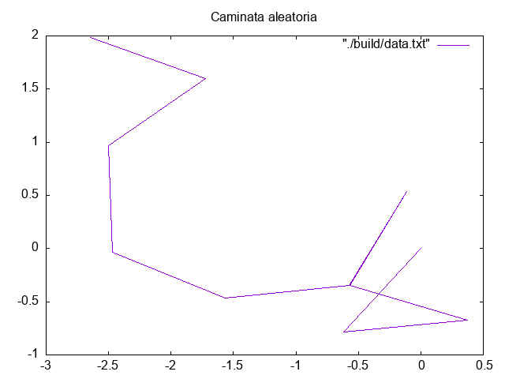

Ejemplo modificado de:  https://www.gnu.org/software/gsl/doc/html/randist.html#examples

Genera una caminata aleatoria en dos dimensiones a partir del origen.

La salida del pograma es el archivo "data.txt"

