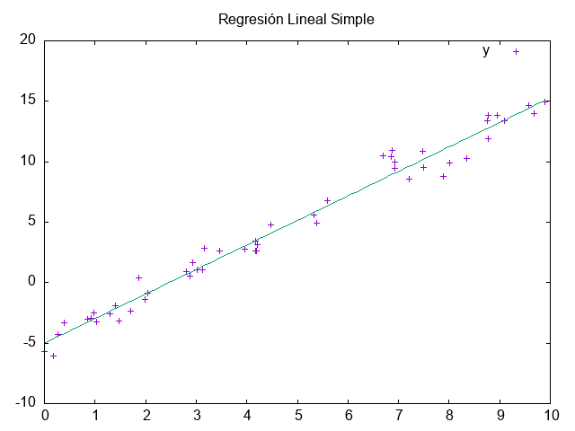

Regresión lineal simple usando datos de un archivo "data.csv" que contiene datos generados aleatoriamente.

Realiza un ajuste de acuerdo al modelo $Y = c_{0} + c_{1}*X$

La salida del programa es la siguiente:

         Read 50 values.
         Read 50 values.
         # best fit: Y = -4.99858 + 2.02721 X
         # covariance matrix:
         # [ 0.0569408, -0.00854264
         # -0.00854264, 0.00182935]
         # sumsq = 40.9169

# Créditos

 La lectura del archivo .csv es mediante el archivo tipo header "rapidcsv.h"; https://github.com/d99kris/rapidcsv