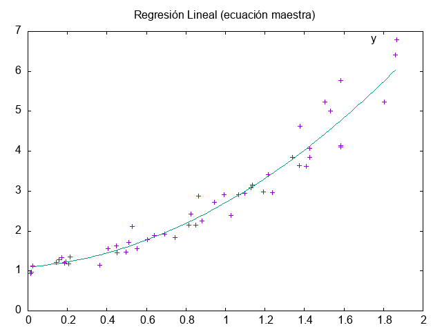
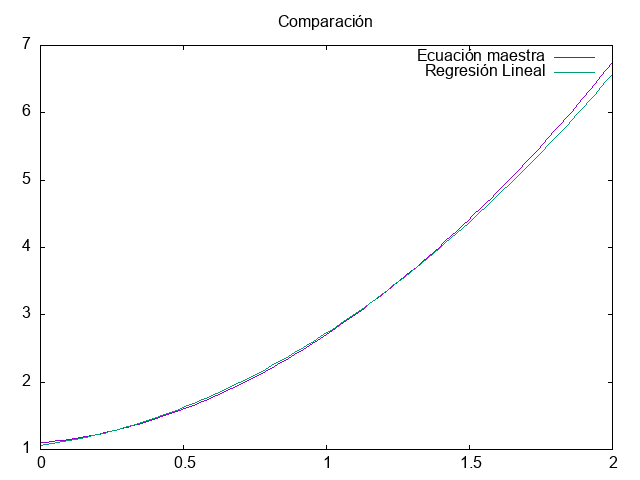

Regresión lineal usando datos de un archivo "data.csv" que contiene datos generados aleatoriamente de una función exponencial con ruido.

Realiza un ajuste de acuerdo al modelo $Y = c_{0} + c_{1}*X + c_{2}*X^2$, mediante la ecuación maestra $\hat{X} = (A^T*A)^{-1}*A^{T}*Y$

La salida del programa es la siguiente:

                Read 50 values.
                Read 50 values.
                # best fit: Y = 1.10055 + 0.391512 X + 1.21488 X^2

Comparación con el primer ejemplo de Regresión Lineal

# Creditos

 La lectura del archivo .csv es mediante el archivo tipo header "rapidcsv.h"; https://github.com/d99kris/rapidcsv

 La función invert_a_matrix fue tomada de https://gist.github.com/bjd2385/7f4685e703f7437e513608f41c65bbd7